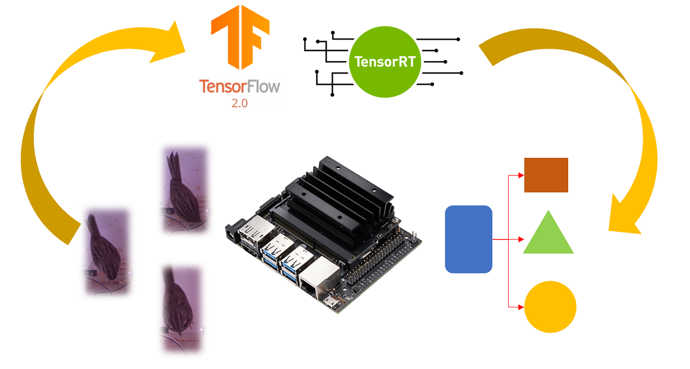
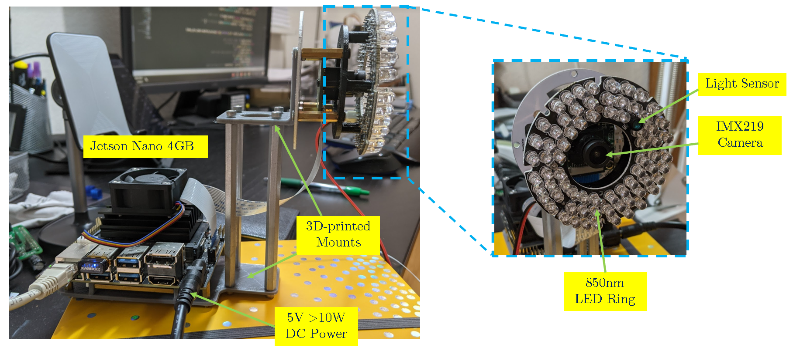
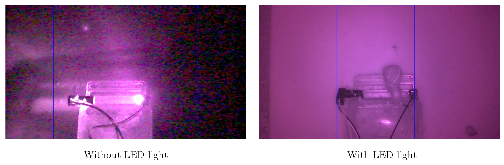
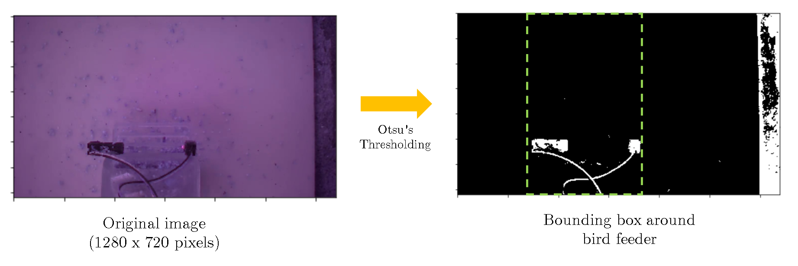
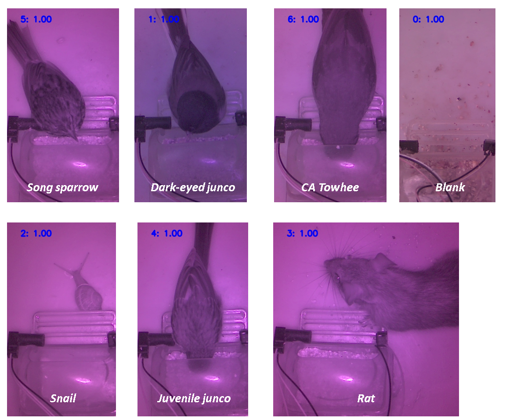
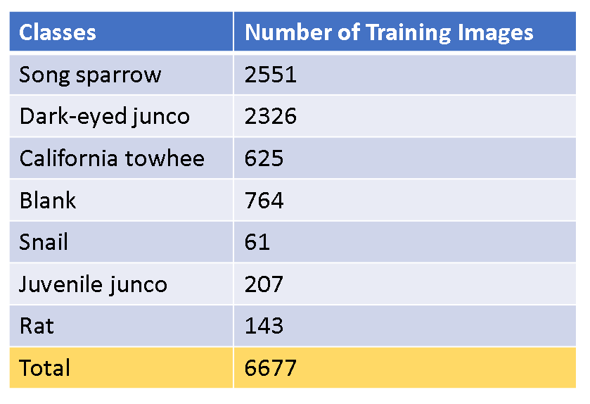
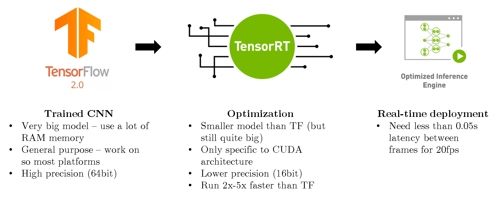
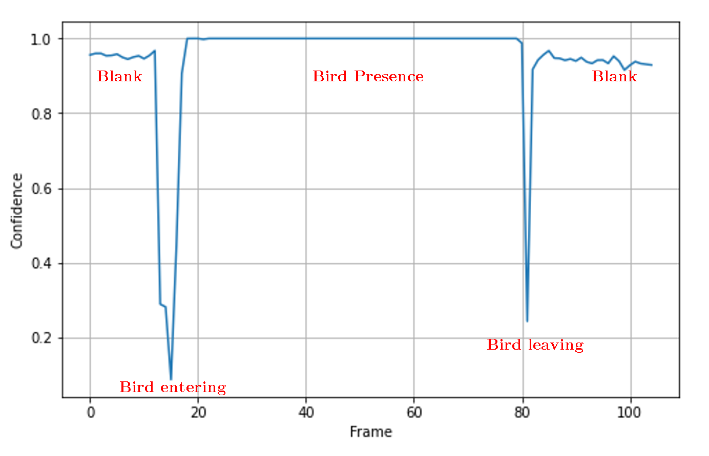
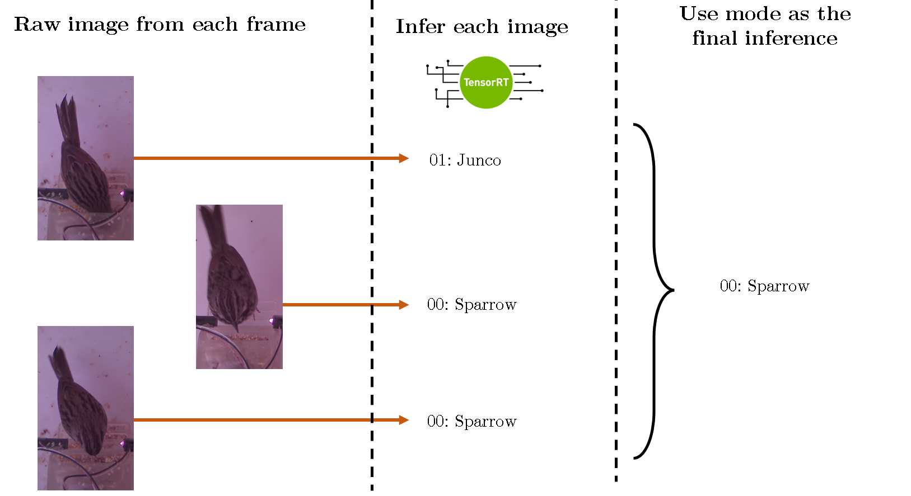

# BirdCam with Jetson Nano

BirdCam is a framework for real-time classification of urban faunas. It was initially developed to classify common urban bird species found in gardens of Southern California. The framework utilizes both traditional image processing and a machine learning approach to perform real-time classification on an Nvidia Jetson Nano. 

# Hardware Requirements

1. Nvidia Jetson Nano with suitable components
	- 5V power supply (>10W)
	- Micro SD card with Jetpack installed
	- (Optional) Cooling fan
2. A Jetson-Nano compatible camera. A Raspberry Pi camera V2 (IMX298) is recommended.
3. Suitable mounting for cameras (3D printed parts etc.)
4. (optional) An IR LED ring light. Only needed if data are collecte during dark hours.

# Software

## `python` Folder
The main script to run is `birdCam_ML_v2_01.py`. Other versions are also available in the folder `python`, but they are still experimental and might be unstable. It needs the `birdCam_jetson_ml.py` to run. The only package that is needed is `Tensorflow` v2. The installation guide can be found on  [Nvidia website](https://docs.nvidia.com/deeplearning/frameworks/install-tf-jetson-platform/index.html "Nvidia website"). 

## `shell` Folder
- Run `optimizeJetson.sh` before running the main BirdCam script to ensure that the Jetson Nano is running at the optimal state. 
- Run `installWifi.sh` if a Wifi Dongle is used. 

## `video_processing` Folder
This folder contains MATLAB files for processing videos. These scripts are still experimental and will be finalize in the next version. 

# Background calibration

The field of view of the camera can be larger than necessary, so we first need to crop out only the region of interest. For this implementation, we use the black sensors at the feeder as the boundary for cropping. Applying Otsu's thresholding yields the detection of these sensors, which can then be used as the boundary as shown here. This auto-calibration is done in the specify interval (10 minutes by default).

# Image Classification

## Model
For the latest version (V2), the deep learning model (supplied in the folder `models`) is trained on seven classes of local faunas. We use the MobileNetV2 architecture and trained the model with 100 frozen layers. We use Tensorflow V2 to implement this convolutional neural net. 

## Inference
To run the model on a Jetson Nano, we have to optimize the Tensorflow model by converting it to a TensorRT model. This model can then be implemented on a Jetson Nano with a very low latency. Note that the shell script `optimizeJetson.sh` (in folder `shell`) should be run before running the main BirdCam script to make sure that the Jetson Nano is operating at the optimal performance. 

When a bird comes to visit the feeder, the model will yield an inference with very low confidence during the transition. The posture of the bird during foraging can also affect the inference. As a result, the final recorded inference is the mode of all frames during the presence of each bird.

